# Partify
**_A party app for Spotify!_**


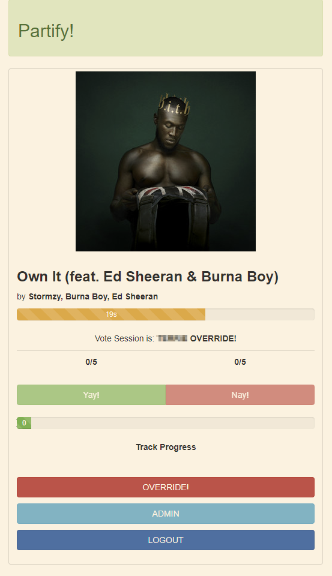

This idea came to me during my wedding preparations; my wife and I didn't want to spend money on a DJ and thought playing tracks through Spotify would suffice. Which brought me onto the idea that maybe we could turn it into a bit of a fun interactive night and allow people to vote on whether to keep playing the song or skip to the next one.

It took about a month to write up, on and off in my spare time with a colleague who knows more about JavaScript than I do. I'm an Azure Consultant, not a programmer. That being said, I know that both Python and JavaScript could indeed likely be improved upon, but what it is at the moment seems very usable.

I used my MSDN account to host the Azure resources because it's free for me, and I'm sure you can re-code this for other cloud providers. You can run the containers on a local machine for testing, but at some point you will need to expose the containers to the internet for people to login and vote.

This is using two docker containers; one as a front end application which users hit, and the other as the backend serving up JSON payload of the current playing track. I chose a front/backend application setup because I only want one instance of Python talking to the Spotify developers API. If I had this as a single frontend application, then the performance will take a hit and I will get many instances trying to call the Spotify developers API; which I found out quickly they deny your requests once you hit a certain rate limit.

Both the front and backend web apps are using simple Python Flask. I used some prior knowledge and Packt Publishing online tutorial (https://subscription.packtpub.com/video/web_development/9781839219924) to get it where I wanted. The backend app runs a split thread where it continuously calls the Spotify API every second to get information on the current playing track. It will then build a JSON file with this information, and is served to the frontend app when called.

I have also included an Admin page that I can log into to update the vote number requirements and how long until it times out. I found that 45 seconds was a sweet spot for the API to be called, JSON to be loaded, and the frontend app to be updated with reasonable time for people to vote.

I use the [Spotipy](https://spotipy.readthedocs.io/) Python addin to perform the requests for me. It's actually quite neat and easy to use, although I couldn't quite get the non-interactive login part to work; it's been nearly 12 months since I did this, so perhaps you can now. Either way, unfortunately I need to run a "pre-start" script in order to get a recent cached token from Spotify to call their API. After that, I run `terraform apply` from my directory and it pulls in all the information needed.

---


## How To Use

I will keep this fairly brief, but hopefully enough that you can run with it. Anyone who's about to use this should at least be familiar with Azure, Docker, Python and Terraform.

### Docker

The image for the containers are in the `00_dockerfile` folder. Please use your basic Docker skills to create a container out of each of them, tagging them appropriately for use.

```bash
docker build -t pmackpartyapp.azurecr.io/partifyback .
docker build -t pmackpartyapp.azurecr.io/partifyfront .
```

### Azure Container Registry

We need somewhere to host our Docker containers; here I'm using Azure Container Registry to keep it all in one area and simple. You can use any other you like, but if you wish use Azure then perform a `terraform apply` on the folder `01_registry` to create the required resource.

Once your registry is up, just push the containers to Azure for use later on.

```bash
Connect-AzAccount -SubscriptionId "xxxxxx" -UseDeviceAuthentication
Connect-AzContainerRegistry -Name "pmackpartyapp"
docker login pmackpartyapp.azurecr.io

docker push pmackpartyapp.azurecr.io/partifyback && \
docker push pmackpartyapp.azurecr.io/partifyfront
```

More information can be found here: https://learn.microsoft.com/en-us/azure/container-registry/container-registry-get-started-docker-cli?tabs=azure-cli

### Spotify

You will need a Develops account with Spotify. Don't worry, it's free, but rate limited on how many times you can hit their API. Create a new application via https://developer.spotify.com/dashboard/applications

With that app created, add the following redirect URIs for the flask front/backend applications:
- http://12.0.0.1:80/
- http://12.0.0.1:5000/

These are used to pass the calls back to the app from Spotify API

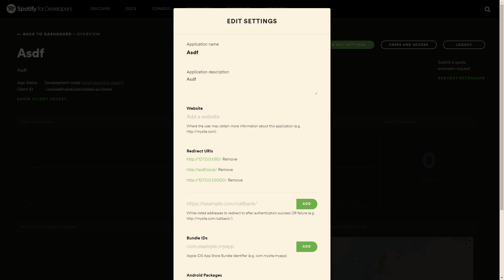

### Azure

Ensure you also have a key vault containing your Spotify Client ID and secret, as I use this to pull in the login credentials via Terraform. You could also do this locally if you wish, but that information will be held in your state file.

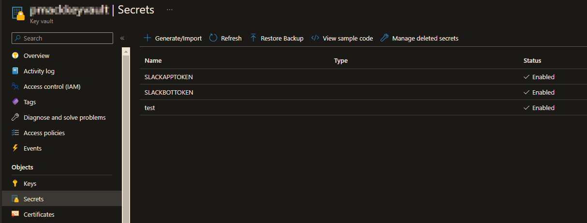


We will now need to run the scripts to retrieve a `cached_token` from Spotify using **Spotipy**. The Bash script will set environment variables used in the Python app, which will then create a token locally, that will then be passed into the container we spin up.

File `run_me.sh` in `02_container`:
```bash
#!/bin/bash

export SPOTIPY_CLIENT_ID='ADD_YOUR_VALUES_HERE'
export SPOTIPY_CLIENT_SECRET='ADD_YOUR_VALUES_HERE'
export SPOTIPY_REDIRECT_URI='http://127.0.0.1:80/'

python3 prestart.py
```

This will run the Python script and echo results that it's done. Now all that is required is to run `terraform apply` to pull in the cached token and pull the containers from your Azure Container Registry to spin up the application.

You will then need to log in using one of the user credentials specified in `users.json` in `02_container` folder. Seeing as though this was a personal use, quick set up, I didn't go for a full blown username/password login; so the usernames are essentially just passwords that allow you to log into Flask. The one prefixed with `admin_` is the admin account which allows you to perform vote overrides and update the vote time count if need be.

To login, just connect to the container DNS url and it should redirect you to the login page if there is no cookie session for you currently running. By this time you also want Spotify running on one of your devices. If it isn't running, the app will poll the API every so often to check for status; and when finally running it'll show you the current playing song.

#### Login
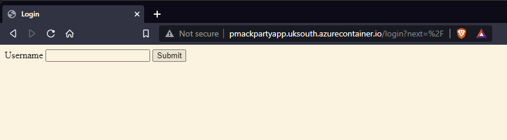

#### Running / Web Vote is Open
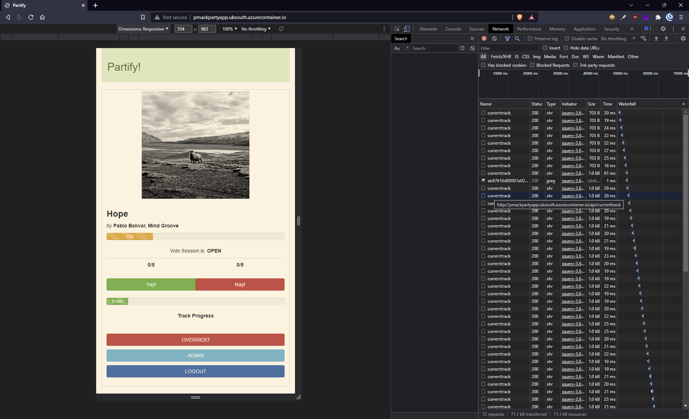

#### Web Vote is Won
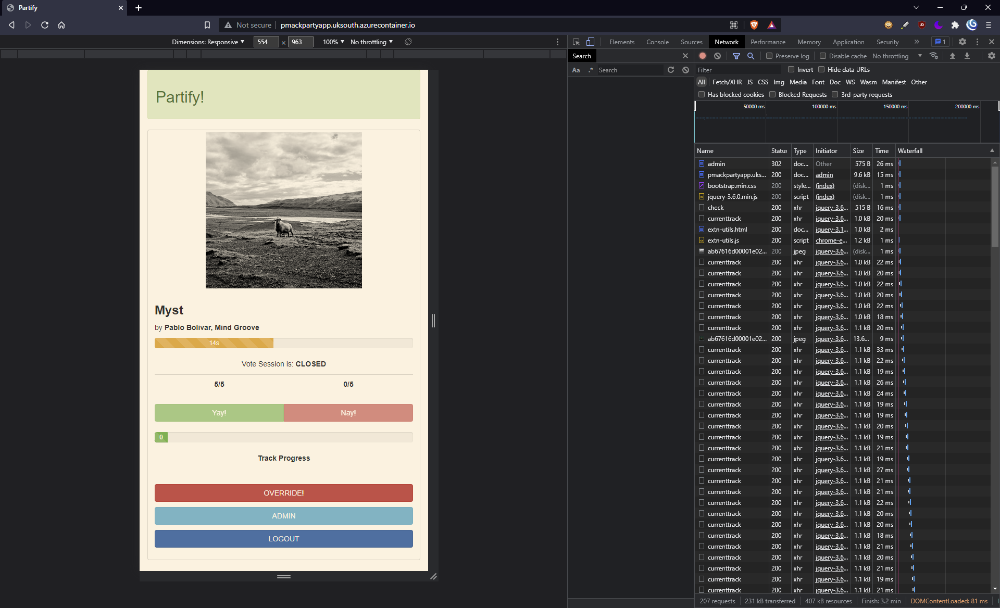

#### Web Vote is Closed
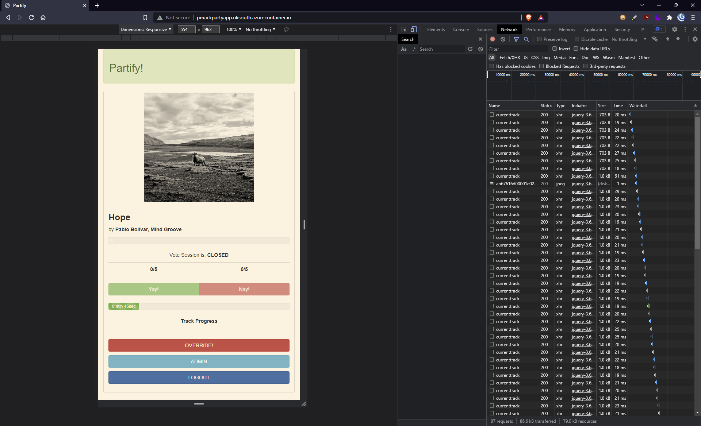

#### Wife Song Override
This is a bit of a hidden gem. You can find the artists unique IDs and preload them into the Python script, so that whenever these artists are rotated into the current playing song, then NO ONE can skip it (this was a wife request/demand). Also, if you're admin, you will have the `Override` button visible to press upon demand to do this.

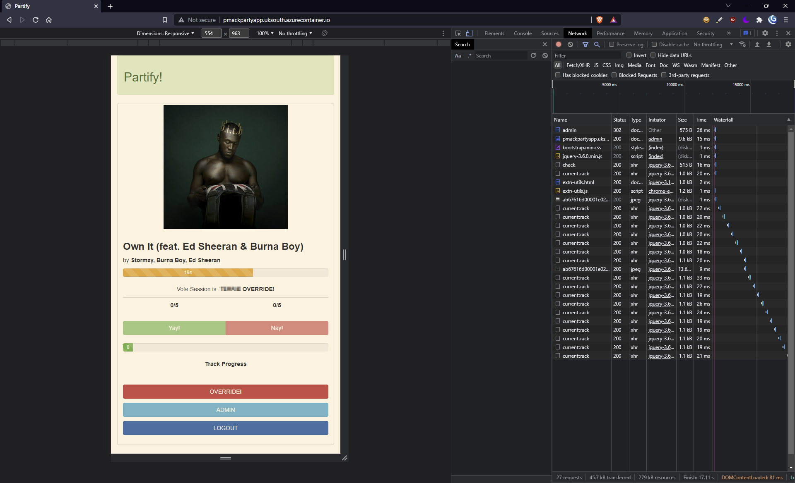

#### Admin Hidden Page
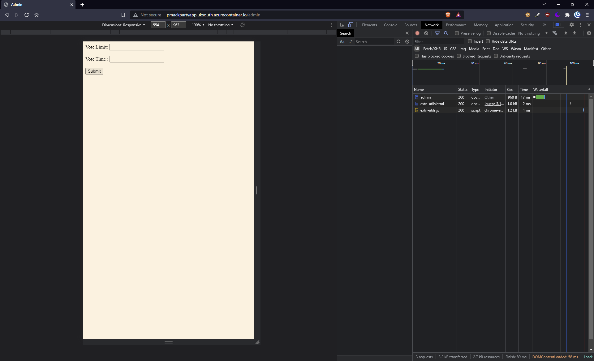

#### Container running
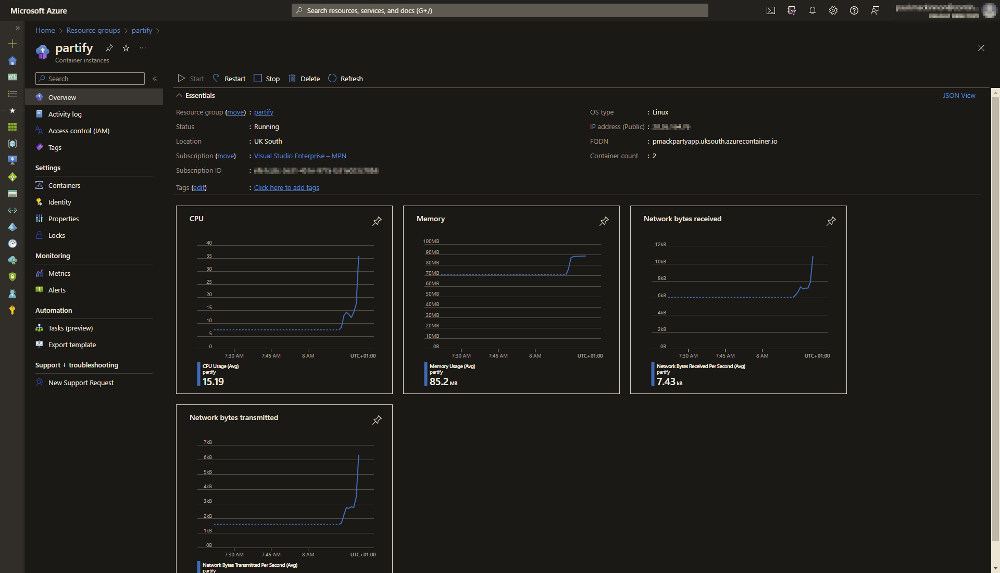

#### Container Spotify activity logs
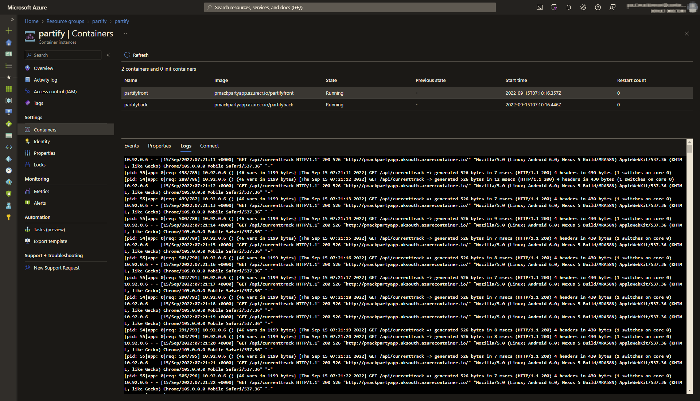